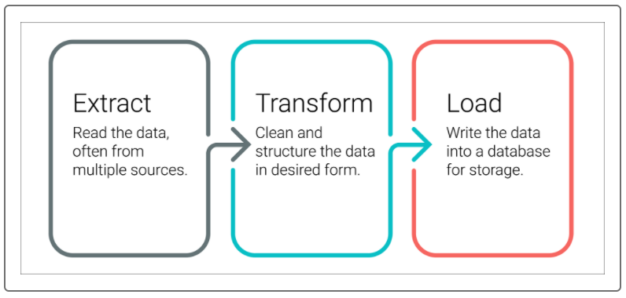

# Movies ETL - Extract, Transform, Load

## Project Overview
Amazing Prime Video is a platform for streaming movies and tv shows on Amazing Prime, the world's largest online retailer. The Amazing Prime Video team would like to develop an algorithm to predict which low-budget movies being released will become popular so that they can buy the streaming rights at a bargain. To inspire the team, have some fun, and connect with the local coding community, Amazing Prime has decided to sponsor a hackathon, providing a clean dataset of movie data and asking participants to predict the popular shows. As a member of the Amazing Prime Video team, I was tasked with creating the datasets for the hackathon. There are two data sources: a scrape of Wikipedia for all movies released since 1990 and rating data from the MovieLens website. I've **extracted** the data from the two sources, **transformed** it into one clean dataset, and **loaded** the dataset into a SQL table.

Extract, Transform, and Load, also known as ETL, is a popular procedure that involves gathering, manipulating, and inserting data into a final destination.

## Resources
- **Data Sources**: `movies_metadata.csv`, `ratings.csv` & `wikipedia-movies.json`
- **Software**: Python, Pandas, PostgreSQL & Git Bash 

## Challenge Overview
Amazing Prime loves the dataset and wants to keep it updated on a daily basis. Therefore, I've created an automated pipleine that takes in new data, performs the appropriate transformations, and loads the data into existing tables. I've refactored the code I used to create the datasets for the hackathon and created one function that takes in the three files--Wikipedia data, Kaggle metadata, and the MovieLens rating data--and performs the ETL process by adding the data to a PostgreSQL database.

## Challenge Results
### Deliverable 1: Write an ETL Function to Read Three Data Files
Using my knowledge of Python, Pandas, the ETL process, and code refactoring, I wrote a function that reads the three data files and creates three separate DataFrames. File name: `ETL_function_test.ipynb`

### Deliverable 2: Extract and Transform the Wikipedia Data
Using my knowledge of Python, Pandas, the ETL process, and code refactoring, I extracted and transformed the Wikipedia data so it can be merged with the Kaggle metadata. While extracting the IMDb IDs using a regular expression string and dropping duplicates, I've included a `try-except` block to catch errors. File name: `ETL_clean_wiki_movies.ipynb`

### Deliverable 3: Extract and Transform the Kaggle Data
Using my knowledge of Python, Pandas, the ETL process, and code refactoring, I extracted and transformed the Kaggle metadata and MovieLens rating data, then converted the transformed data into separate DataFrames. Then, I merged the Kaggle metadata DataFrame with the Wikipedia movies DataFrame to create the `movies_df` DataFrame. Finally, I merged the MovieLens rating data DataFrame with the `movies_df` DataFrame to create the `movies_with_ratings_df`. File name: `ETL_clean_kaggle_data.ipynb`

### Deliverable 4: Create the Movie Database
I used my knowledge of Python, Pandas, the ETL process, code refactoring, and PostgreSQL to add the `movies_df` DataFrame and MovieLens rating CSV data to a SQL database. File name: `ETL_create_database.ipynb`
